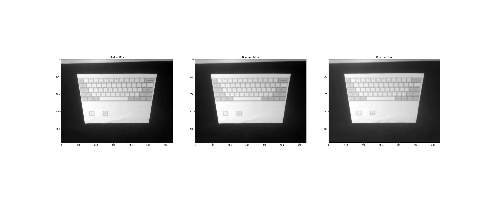
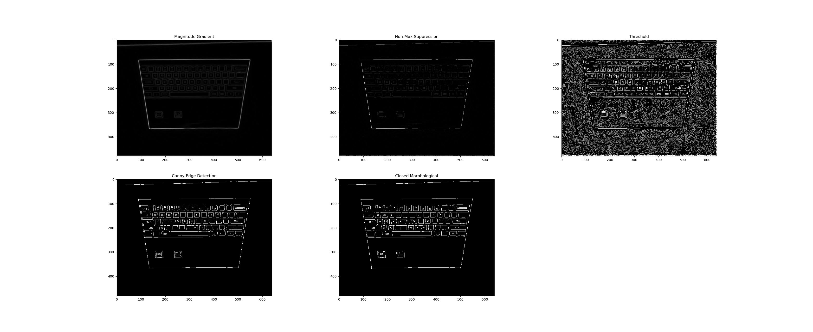
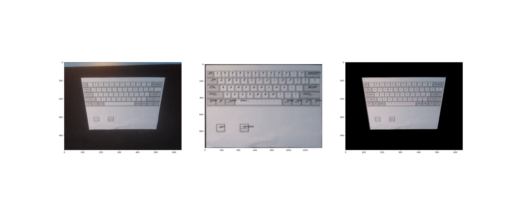

# CV_Project

Computer Vision Final Project
-----------------------------
Hardware needed: 
-	Computer Webcam 
-	Printed “printed_keyboard.docx” on a piece of paper
During development, we utilized a webcam “Logitech HD Pro Webcam C920” to the video which supported up to 720p HD video calling at 30fps. Additionally, the document was printed which showed the keyboard for use when determining which key was clicked. We used a black background below the white paper keyboard for easier contrast when determining the edges of the paper. Last, if running the project directly on the command line, please ensure the command line is viewable so the printed output is displayed.
  
Instructions to Run:
1)	In order to run the Keyboard Typer project, the installations of the following libraries are required:
pip install mediapipe
pip install numpy
pip install opencv-python
pip install matplotlib

2)	Set up your webcam on top of your monitor and point it downwards towards where you would set up your own keyboard. The script will flip the image to represent the angle as shown above.

3)	To begin running the project, navigate to the project folder and open the CMD and type “python main.py”
 
4)	Let it load and give it a few seconds to read and process the current frame to determine the keyboard location. It will then display the different filters, edge detections, and warped transformation images accordingly. Feel free to exit those figures to continue (examples below).

5)	To click on a key, place your index finger of either hand over a key on the paper for around 2 seconds to have it register the click, and the key that’s clicked will display on the command line.
 
6)	If you’d like to quit, please click the “quit” key on the printed keyboard or hold “q” on your real keyboard.

7)	If you’d like to reset the keyboard, either click the get keyboard key or hold “c” on your real keyboard.

## Images:
 
 
 

